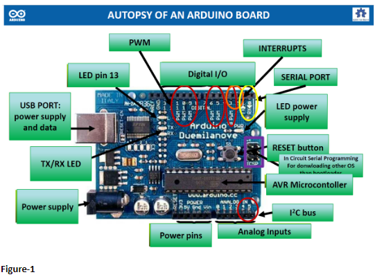
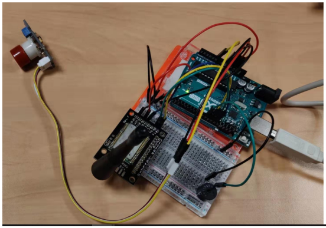

[HOME](./index.md)

## Course Overview & Learning 

### Course 1 : Smart Device - Pr. Jeremie GRISOLIA
### Module A : Microcontrollers and Open Source Hardware + Sensors

### Group Members
Xuantang, Zhe, Huijie, and me
### Git Hub link
https://github.com/MOSH-Insa-Toulouse/2019_MOSH_B1_XUANTANG_HUIJIE_ZHE_Mohan

#### Descriptive Part :
In the Micro-Controllers and Open Source hardware, for the first time, I experienced to work with such small size arduino micro-controller boards. I did the TP exercises with the following objectives for learning and skill development on implementation of an Open source hardware 
- Use the TP’s from TP-1 to TP-4 to understand the hardware and software components in an Arduino board and how they can be used together to make simple applications using displays, motors, sensors, Nunchuk, touch-screen
- Use the TP-5 and follow the green track and blue track 
1. for making an IoT application - simple LoRA communication pair
2. for integrating the ‘gas sensor’ data acquisition system with the ‘LoRA pair’ and making a small prototype

#### Technical Part : 

I started exploring the Arduino hardware and its various interfaces that are found in Figure-1. 

- As I am from a business studies background, I stayed with a main focus of understanding on how to do TP-5 green & blue track. For the same, I took help from my group members. 
- From TP-1 to TP-4, I learnt to load Arduino software to the Arduino board and do simple applications. 
- From the group, I learnt of doing the green track whereby the LoRA communication pair is created using the Arduino Uno board, LoRA chip RN2483A.
- From the group, I got familiarized in doing the blue track whereby the gas sensor and LoRA pair were interfaced using the Arduino Uno board. 

With Arduino, we achieve to make a detecting system that when the gas index is higher than our standard, the buzzer will alarm. We used interruption of arduino to do this. The code is in the folder. After the soldering of the LoRa chip RN2483A, we succeed in communicating with the TTN platform.
- Also, I learnt to optimize the energy consumption of LoRA by placing it in sleep mode
- And, I learnt how to use KiCAD to establish a best circuit between LoRA module and the gas sensor. 
Please find the below documents at https://github.com/MOSH-Insa-Toulouse/2019_MOSH_B1_XUANTANG_HUIJIE_ZHE_Mohan
1. Arduino Software files
2. Kicad files
3. Node-Red dashboard

#### Self Assessment:

|Communication and Protocols|Skill-level expected|Self-assessment|
|---------------|--------------|---------------|
|Understand microcontroller architecture and how to use them|2|2|
|Be able to design data acquisition system (sensor, conditioner, microcontroller) with respect to the application|2|2|
|Be able to design the electronic circuit of a sensor’s signal conditioner (design + simulation)|2|2|
|Be able to design a shield to accommodate the gas sensor|2|2|
|Be able to design the software to use the gas sensor and its HMI|2|2|
|Be able to combine all of the above mentioned components into a smart device|2|2|

#### Resources
https://github.com/MOSH-Insa-Toulouse/2019_MOSH_B1_XUANTANG_HUIJIE_ZHE_Mohan
Datasheet

Go to Homepage [HOME](./index.md)
