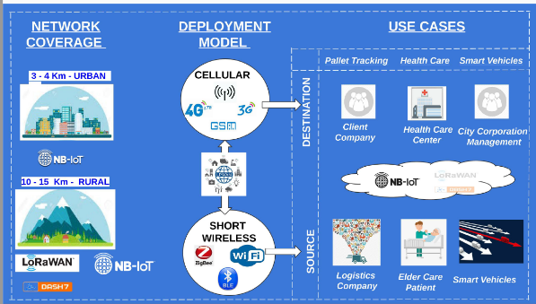
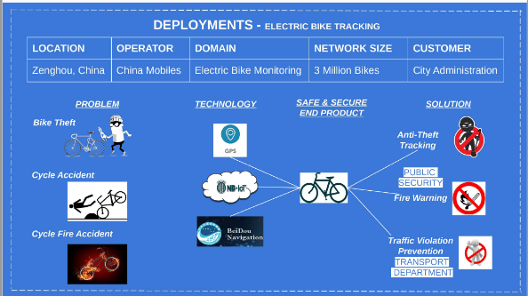
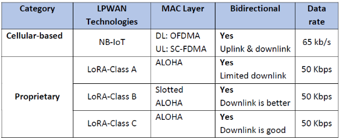
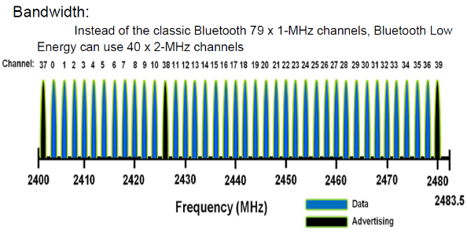

[HOME](./index.md)

## Course Overview & Learning

### Course 2 : Communication 
### Module A : Communication Protocols - Pr. Daniela
### Module B : Communication technologies - Pr. Alexandre
### Module C : Communication Protocols TP - Pr.Laurent CHASSERAT / Pr.Loubet

#### Descriptive Part :
**A. Group work on Physical and MAC layer of NB-IoT tech** 
Being part of the 3-member group, the work I did was on NB-IoT technology especially with focus on Physical and MAC layer technical specifications and real-world deployment cases. 

**B. Individual work on MAC Layer for IoT Networks** 
In this individual work, I explored the MAC layer functions in the IoT LPWA networks. Especially, I chose one ‘licensed’ and one ‘proprietary’ technology, compare them with respect to MAC layer functions such as ‘cell access’, mobility of connected devices. 

**C. Group exercise based on BLE tech** 
In this group exercise, we learnt to solve questions on physical layer aspects of Bluetooth Low Energy – frequency band, modulation methods, packet structure, throughput, effect of interferences, transmitted power, sensitivity, radio range in free space and indoor.

**D. Individual work on GNURadio** 
In this work, I explored the applied mathematics concepts behind the modulation and demodulation of wireless transmission technologies. 

#### Technical Part :

**A. Group work on Physical and MAC layer of NB-IoT tech**

I collected the Physical and MAC layer specifications details of NB-IoT technology such as bandwidth, data rate, mobility, Modulation etc. Then, I compared the specifications with the other cellular technologies such as LTE-M. And, also, I compared with other LPWA technologies such as Sigfox, LoRa. 

For further study on real-world field deployment, I made study on the ‘Electric Bike tracking and management’ solution that is deployed in Zhenghou, China. 

**B. Individual work on MAC Layer for IoT Networks**
In the ‘cellular’ based technology category, I chose NB-IoT and in Proprietary category I chose LoRA technologies. I investigated the MAC layer access method mechanisms. 

**C. Group exercise based on BLE tech**

In this group work, I learnt the physical layer transmission techniques used in BLE and the applied mathematics behind the theory concepts such as, 
- nyquist formula for calculating bandwidth
- relation between the connection state and sleep state in determining the throughput
- PDU and MTU size which are determined based on the connection interval
- Adaptive frequency hopping technique for reducing the interferences
- Friis formula to calculate the free space path loss and thus the range

**D. Individual work on GNURadio**

In this work, the focus is on applying the theory concepts & the math.  
- Application of Shannon’s theory for determining the sampling period
- Reception of the frequency modulation based transmitted signals (FM Radio) 
- How to demodulate the received FM signal; how to measure the SNR
- How to measure the bandwidth, using frequency offsets for centering
- Relation between the center frequency and sampling frequency

#### Skills analysis : 

Below, please find the skills that I acquired,
- Understanding on how to compare computer networks (vs) telecom networks (vs) IoT Networks
- Understanding on attributes and their importance for IoT networking such as range/coverage, throughput, data rate, interferences
- Understanding on making choices within short-range wireless technologies for IoT based on attributes such as modulation, uplink/downlink
- Understanding on making choices within long-range ‘licensed’ wireless technologies for IoT such as NB-IoT, eMTC based on Physical layer and MAC layer technologies, modulation, uplink/downlink
- Understanding on making choices within long-range ‘unlicensed’ wireless technologies for IoT such as LoRa, Sigfox based on Physical layer and MAC layer technologies
- Understanding on making choices of IoT network technologies based on the use-cases requirements and the importance of coexistence of multiple communication technologies. 
- Scanning the market for emerging technologies, choosing a technology, investigate on its past and its future evolution with respect to the industry, use-cases, standardization/certification bodies (3GPP, ITU, IEEE, ETSI etc) 
- Conducting estimation of power & energy consumption of battery and recommend a proposal for optimal transmission strategies for IoT applications

|Communication and Protocols|Skill-level expected|Self-assessment|
|---------------|--------------|---------------|
|Understand the major development phases for mobile communications and development of the associated technology|3|2|
|Understand the impact of new mobile technology|3|2|
|Be able to analyse and evaluate optimal wireless network technologies|3|2|
|Be able to suggest optimal technological solutions for IoT networks|3|2|
|Understand and master optimisation of communication protocols for IoT with respect to energy limitations|3|2|
|Understand and master optimisation of communication protocols with respect to security concerns|3|2|
|Know the main processing techniques used for digital communication and know how to explain the basic structure of digital RF transmitter-receiver|3|2|
|Mastering the architecture of an energy management system, simple storage, energy recovery, know how to size the storage element according to the specifications|3|2|

Go to Homepage [HOME](./index.md)
