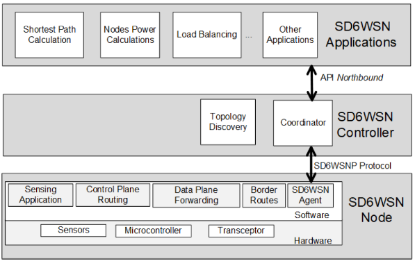

[HOME](./index.md)

## Course Overview & Learning 

### Course 3 : Smart Device - Pr. Etienne Sicard, Pr.Slim Abdellatif
### Module A : Wireless Network 3G - 6G
### Module B : Emerging Networks (SDN, LISP)

#### Descriptive Part :

In this short course, I had gained an introductory knowledge on subjects listed below, 
- Delay/Disruption tolerant networking
- Network Management, SDN based NMS
- Information Centric Networking, SDN based networking
- North bound interfaces (NBI) and South bound Interfaces (SBI)

I had the theoretical conceptual knowledge and hands-on experience from TP on following subjects, 
- Setting up a switch that supports OpenFlow 
- Deployment of a control application that runs COAP application
- Creating new network applications at North bound interface 

#### Technical Part : 

- Flow based approach vs destination-based approach in networking
- TP Practice sessions on Openflow of South-bound interface programming and managing Pica8 switch
- Using Openflow to program the ‘data plane’ network functions
- Extensive study and analysis of a scientific articles and the below mentioned SDN based WSN architecture, 

#### Skills analysis : 

- Hands-on experience in creating an SDN Open flow network
- Basic understanding of operation of SDN based WSN IPV6 network and architecture design
- Understanding of the protocols and the components that make a SDN based WSN network

Go to Homepage [HOME](./index.md)
