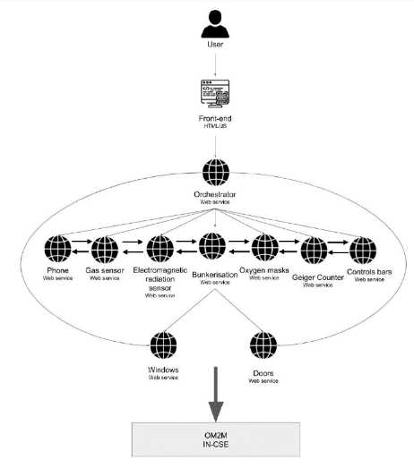
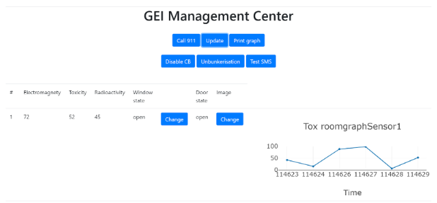

[HOME](./index.md)

## Course Overview & Learning - Pr. Nawal Guermouche

### Course 5 : Service Architecture
### Module A & B : SoA and Software Engineering

#### Descriptive Part :
In this SoA course, to practice our knowledge on SOA, micro-services and OM2M, we did a project on GEI building management. We imagined that the GEI building has several rooms and, in each room, there were sensors for toxicity, electromagnetic field, radioactivity etc and highly sensitive actuators (doors, windows). 

**Simplified user stories**
- _**Too much toxicity?**_
Bunkerize the GEI and call the emergencies, don't let dangerous gas get out of the building!
- _**Too much electromagnetic field?**_
Call the emergencies and play the Ghostbuster jingle!
- _**Too much radioactivity?**_
It means that the nuclear reactor of the GEI is melting, needs to make the control rods fall in order to stop the nuclear reaction! Also call the emergencies.
- _**It's night/daytime?**_
Close/open windows and doors!

To communicate with these different sensors/actuators in each of the room of the building and manage them from a central management center, we developed the OM2M architecture, micro-services, backend based on Springboot and front-end based on jQuery/Bootstrap. 

#### Technical Part :
In my role as a member, I contributed on 2 areas, 
- In the design phase, contribution in making user-stories 
- In the development phase, Java class implementation for automation of OM2M architecture creation and deletion

#### Skills analysis : 

- Using Java for automation of OM2M architecture; hands-on experience in using OM2M for a bigger project
- Conceptual understanding of deploying micro-services in a SoA architecture for IoT applications
- Making user stories and translating them to software requirements and further into design level thinking
- Understanding on End-to-end IoT solution designing - from sensors to SoA to cloud to user reporting

#### Self-assessment :

|Skills|Expected Skill|Self-Assessment|
|----------|-----------|---------|
|Know how to define a service-oriented architecture|3|2|
|Deploy SOA architecture by implementing web services|3|2|
|Integrate a service orchestrator in an SOA architecture|3|2|

Go to Homepage [HOME](./index.md)
