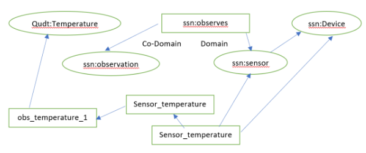
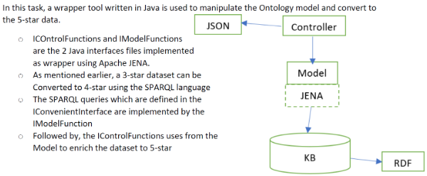

[HOME](./index.md)

## Course Overview & Learning - Pr. Nicolas Seydoux

### Course 7 : Data and Application
### Module A : Semantics - Processing Semantic Data 
#### Descriptive Part :

Using Protégé, I have attempted to create an ontology model for the ‘Meteorological Application’.
Followed by, using the sample dataset from Aarhus city, Denmark I attempted to understand

- How the ‘Apache Jena wrapper classes’ in Java can be used on the sample dataset
- How the ontology can be manipulated
- How the SPARQL queries can be executed using the Jena to perform the ‘knowledge base’ operations
- How the 3-star or 4-star dataset can be improved to 5-star dataset

#### Technical Part :

- Creation of Ontology

I attempted to build the ontology design based on the ‘triple’ for temperature related dataset of Aarhus, Denmark.

- Conversion of 3-star data to 5-star data

#### Skills analysis : 

- Apache Jena wrapper classes
- Protégé software
- Ontology manipulation
- SPARQL
- Conversion of 3-star or 4-star to 5-star dataset that is more suitable for IoT applications

|Processing Semantic Data|Expected Skills|Self-Assessment|
|------------|------------|-----------|
|design and understand a model for an application|2|2|
|Know how to infer new knowlegde from a knowledge base|2|2|
|Be able to enrich data with semantic meta-data|2|2|

Go to Homepage [HOME](./index.md)
