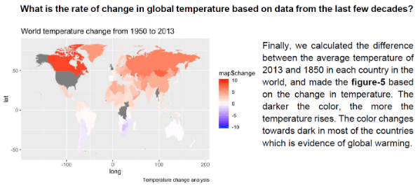

[HOME](./index.md)

## Course Overview & Learning - Pr. Gilles Tredan

### Course 7 : Data and Application
### Module B : Data Processing & Big data

#### Descriptive Part :
In this data analysis project, we choose a dataset, explore, analyse and attempt to confirm a hypothesis. As a 2-member team, I have chosen a dataset related to ‘temperature rise/Global warming’. The hypothesis we made was that the increase in temperature across the globe is due to global warming & climatic changes across the globe.

#### Technical Part :
In the project, I followed a structured approach in exploring the data and analysing it as found in below steps:
1) Data cleaning and pre-processing
2) Data observation - How is the temperature variation of the selected countries during a year?
3) Temperature Trend Analysis - How is the change in temperature of the selected countries during the last 300 years?
4) How can we relate the trend in temperature change of those selected countries to the global temperature change?
5) What is the rate of change in global temperature based on data from the last few decades?

#### Skills analysis : 

- Learnt the basics of R, the popular data analysis programming language
- Learnt to choose data sets based on problem to be investigated, datasets based on self-interests for further exploration
- Problem formulation (Hypothesis) and framing a data exploration strategy
- Choosing plots/graphs and using R for implementation
- Making sense of data using plots and graphs
- Learning from data analysis results and using them to further explore the data and answer more difficult questions

#### Self Assessment:

|Data Processing and Analysis: Big Data|Skill-level expected|Self-assessment|
|----------|---------|-----------|
|Know how to explore and represent data sets|2|2|
|Master R|2|2|
|Master complexity associated to statistical data processing and know the techniques to be used to minimise them|2|2|

Go to Homepage [HOME](./index.md)
