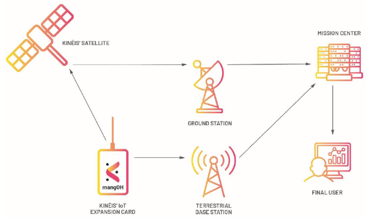
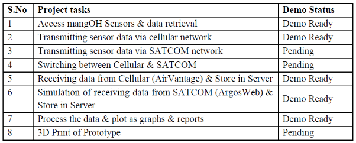

[HOME](./index.md)

## Course Overview & Learning

### Course 5 : Company Project
### Module A : Innovative Project

#### Descriptive Part :
In the innovative project, we are group of 5 members with different study/experience/skills background. We chose a project with Kineis, a New Space IoT Network Operator wants to create a converged IoT End-device (Beacons, trackers) with transceiver capabilities of both terrestrial cellular/LPWAN and SATCOM protocols. The company’s mission is to establish a constellation of satellites in the LEO orbit of space and use it as a SATCOM communication network for IoT use-cases on earth such as telemetry, tracking, alarms.

#### Project Challenge :
Conventionally the IoT End-devices used in IoT applications & services have support for only terrestrial network technologies such as Cellular (3G/4G/LTE-M) and LPWAN (LoRA, Sigfox, NB-IoT) for data transmission. Because of which the IoT use-case deployments are constrained within the coverage scope of terrestrial network.  This is a business pain area for IoT network operators and end customers who wants to use SATCOM network and deploy IoT use-cases in remote terrains & oceans where terrestrial network coverage is not available. Kinéis believes that by making a End-device that can switch between terrestrial network and their SATCOM network for data transmission it can address a huge business opportunity. Kinéis plans to develop a prototype of the end-device using the open source mangOH hardware and KIM-1, a SATCOM transmitter module for validation of the concept.
From INSA, our group joins the Kinéis endeavour in developing a prototype for ‘multiprotocol mangOH
converged IoT End-device’. The important project tasks and the status are as found in table below,

#### Technical Part :
In my role as a member, I contributed on 2 areas, 
1. Retrieval of sensor data that are transmitted via Cellular network
- Technologies those I used: REST API, POSTMAN, python 
2. Transmission strategy & data aggregation strategy
- For Cellular and SATCOM, I made assumptions on how many times transmission can happen, how long it can happen, when data transmission can happen
- I assumed of configuring mangOH and KIM-1 SATCOM transceivers in ACTIVE and SLEEP modes 

**Battery life estimation **
- Made estimation of what is power consumption in ACTIVE and SLEEP modes for mangOH card and the KIM-1 module
- Consolidated all the data, and estimated the battery life duration 

#### Skills analysis : 

- Gathering technical requirements for an IoT solutions that requires a converged communication solution made up of SATCOM + another terrestrial network
- Figuring out the components that are required to make a prototype – embedded hardware (mangOH, sensors) and software applications (Legato), communication modules (KIM-1, cellular sim), server applications (REST API, web services), data reports (dashboards)
- Corelate the technical specifications of hardware and communication technology and prepare a optimal transmission strategy and data aggregation strategy
- Conducting estimation of power & energy consumption of battery and recommend a proposal for optimal transmission strategies for IoT applications

#### Self Assessment:

|Innovative Project|Expected Skill-level|Self-Assessment|
|--------|-----------|------------|
|Analyse a real-life problem|4|4|
|Suggest a technological solution to a problem|4|3|
|Implement a prototype to solve the problem|4|3|
|Present and debate (in English) the technical choice made|4|4|
|Produce a report (in English) for the developed project|4|4|

Go to Homepage [HOME](./index.md)
